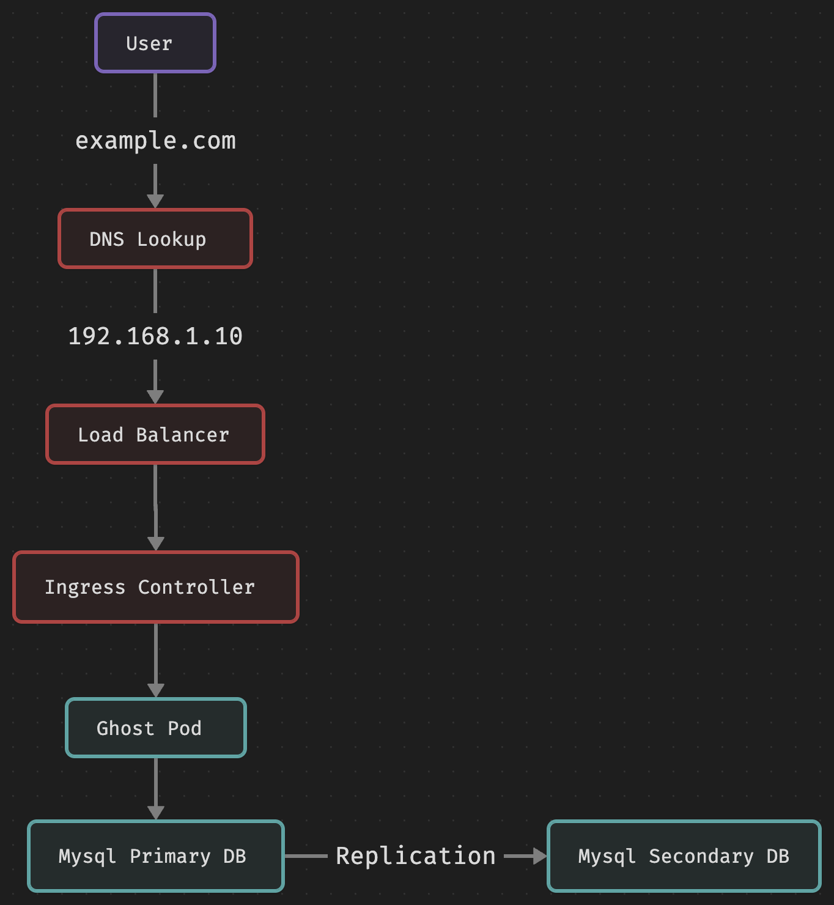

[Ghost](https://ghost.org) is used by creators for running their own website to publish private content

## Flow Diagram


## Quickstart Install

These instructions are for ghost installation on bare metal kubernetes cluster using `helm`.

1. Run build dependency command to create bitnami mysql helm chart in ghost helm charts directory
```bash
helm dependency build ./ghost --debug
```
2. Deploy [local-path-provisioner](https://github.com/rancher/local-path-provisioner) storage class but it does not support `readwritemany` so for high availability of your kubernetes cluster better to use `longhorn`
```bash
# mak sure following packages are installed in kubernetes nodes
sudo apt-get install nfs-common cifs-utils -y
# longhorn
helm repo add longhorn https://charts.longhorn.io
helm repo update
helm upgrade --install longhorn longhorn/longhorn --namespace longhorn-system --create-namespace
# make longhorn storage class as false so that we won't have multiple storage classes as default
kubectl patch storageclass longhorn -p '{"metadata": {"annotations":{"storageclass.kubernetes.io/is-default-class":"false"}}}'
```
3. Deploy ghost
```bash
helm upgrade --install ghost ghost --namespace example --create-namespace -f custom/ghost/example.yaml
```
4. Deploy ingress nginx controller to access ghost publicly with custom values in `custom/ghost` directory
```bash
helm repo add ingress-nginx https://kubernetes.github.io/ingress-nginx
helm repo update
helm upgrade --install ingress-nginx ingress-nginx/ingress-nginx --namespace ingress-nginx --create-namespace -f custom/ghost/nginx.yaml
```
6. Create ingress rules for routing traffic to ghost pod
```bash
kubectl apply -f custom/ghost/ingress.yaml -n example
```

> Note: Deploying self hosted ghost on kubernetes with multiple replicas is not supported yet, we will be deploying it with only 1 replica.